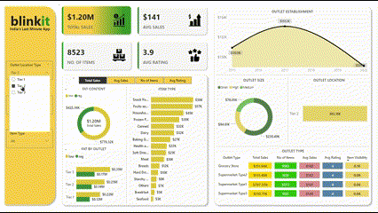

# Blinkit-PowerBI-Analysis
I built an interactive Power BI dashboard for **Blinkit**, using grocery sales data sourced from [Kaggle](https://www.kaggle.com/datasets/mukeshgadri/blinkit-dataset). The dashboard provides insights into sales trends, category performance, and operational metrics.
## Features
- Visualized sales data to track trends and peak periods.  
- Analyzed category performance and customer preferences.  
- Monitored operational metrics like delivery times and order fulfillment rates.  
## Tools and Dataset
- **Tools**: Microsoft Power BI, Excel  
- **Dataset**: `BlinkIT Grocery Data.xlsx` (sales, product categories, order details)
## How to Use
1. Open `blinkit.pbix` in Power BI.  
2. Explore visualizations and interact with filters for detailed insights.
## Future Plans
- Add real-time data integration.  
- Expand dataset for broader analysis.  
- Explore predictive analytics using machine learning.
## Dashboard Preview

